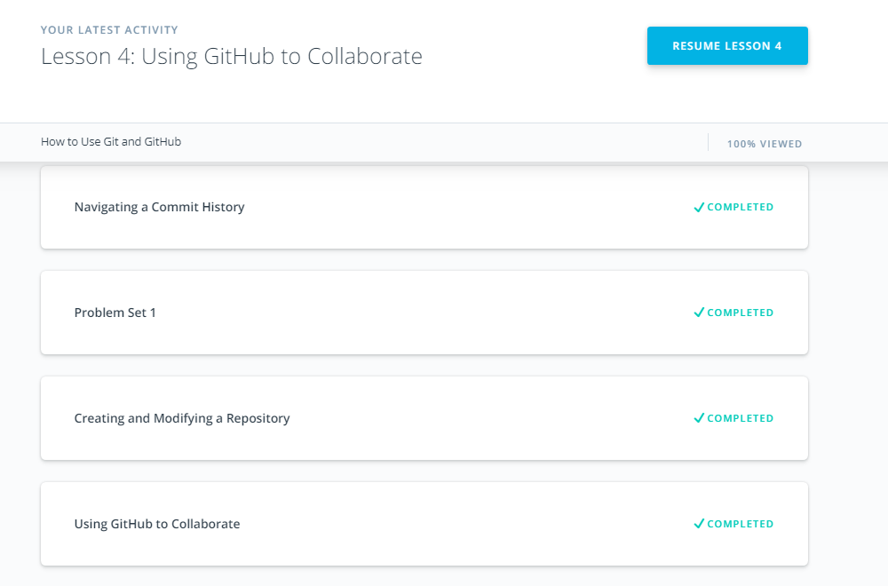
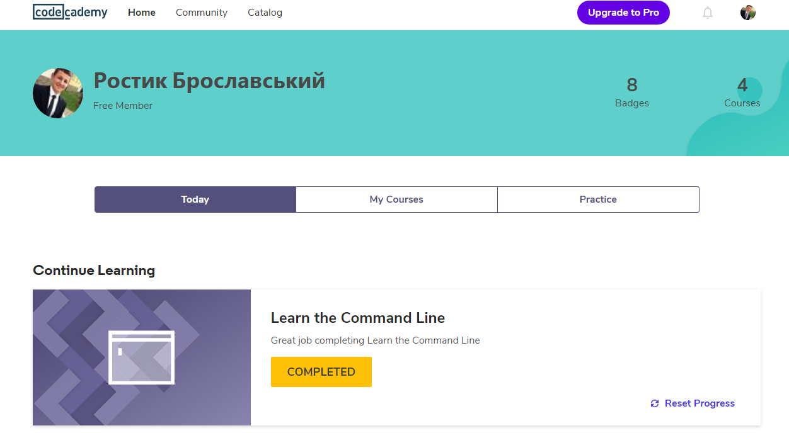
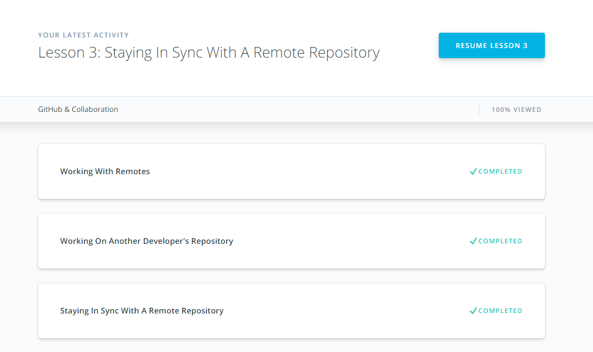
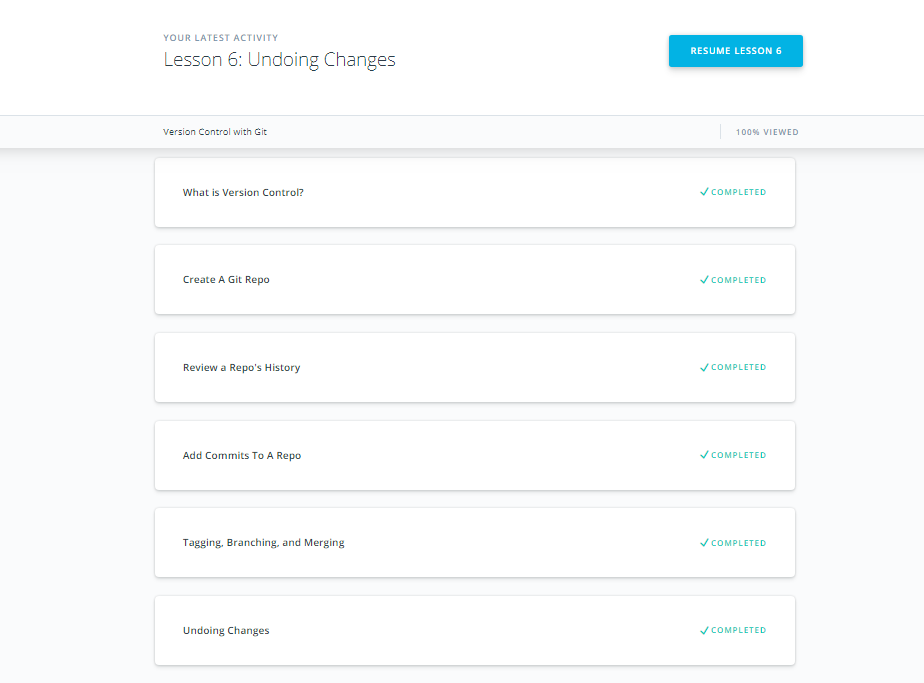
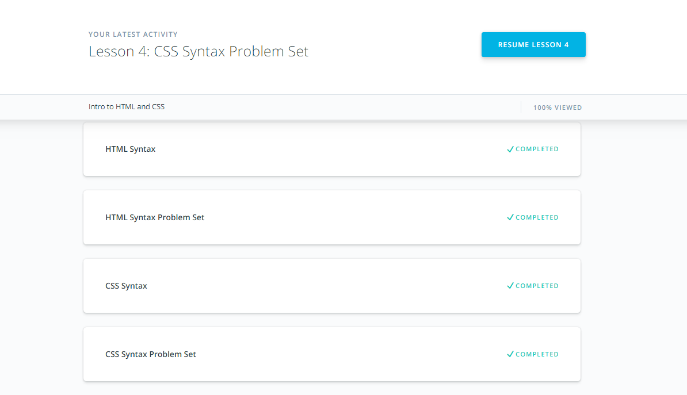
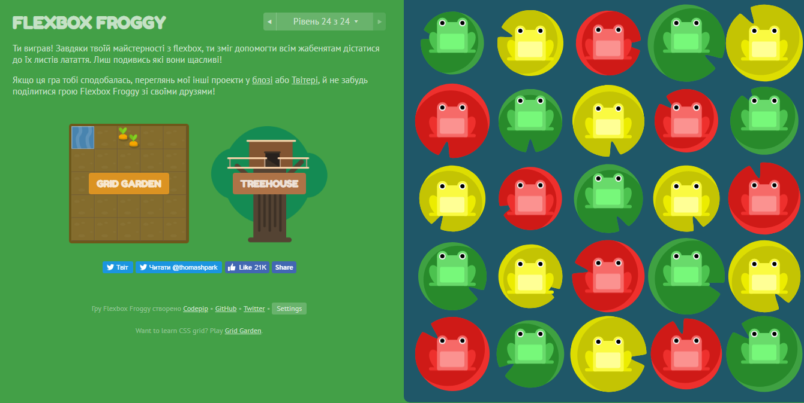
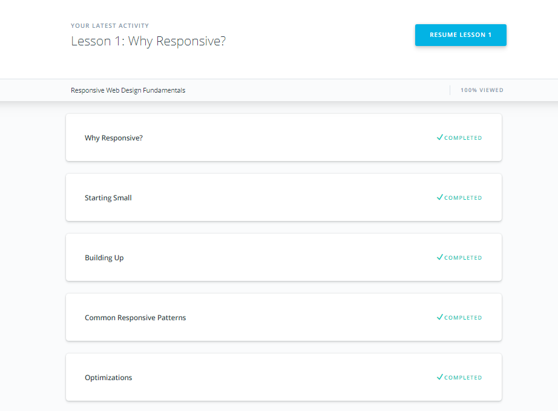
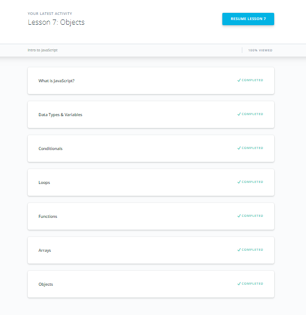
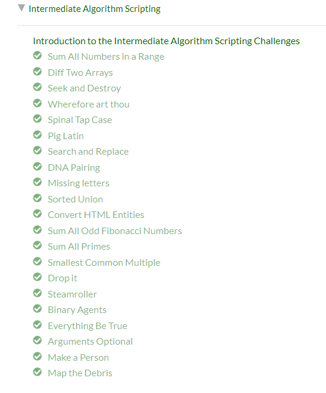
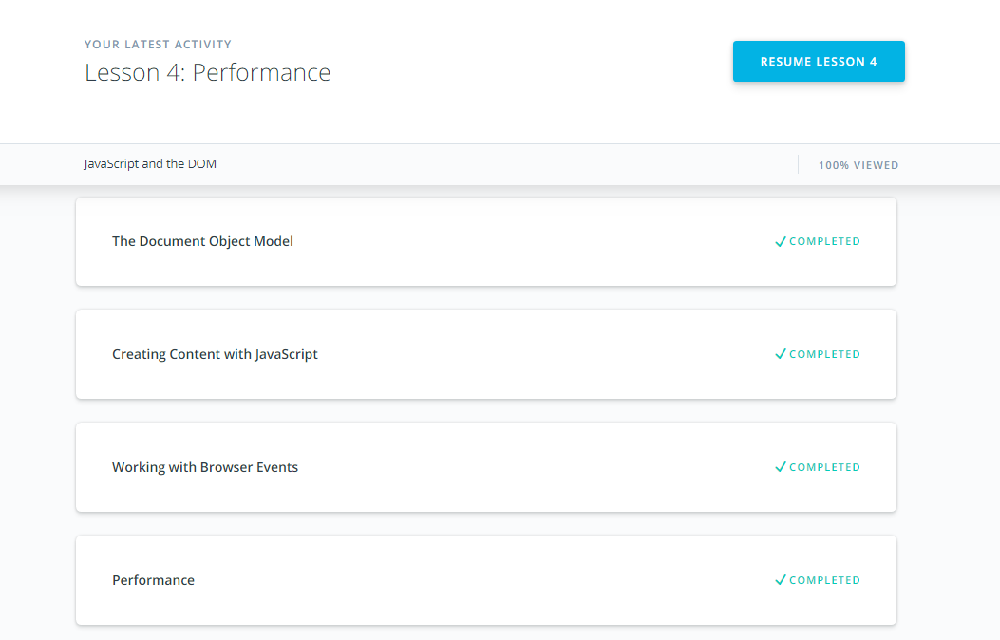

# kottans-frontend

# General Basics

## 1. Git Basics
- Here I repeated the basics and also learned some new commands such as.
- `git diff`
- `git log --graph --oneline`
- I liked it)

## 2. Linux CLI, and HTTP
- I learned a lot of new things like bash scripts. 
- Repeating how the http works.

## 3.VCS (hello gitty), GitHub and Collaboration
- I learned how to work with different branches.
- New commands for me
- `git commit --amend`
- `git shortlog`

----------------------------------------------------------------------------------------------------------------------------------------

# Front-End Basics

## 1.Intro to HTML and CSS
- Previously I already finish this sections. I repeat some theme, repeat CSS. 
- I learned this before.

## 2.Responsive Web Design
- Flexbox froggy. I repeat it again.
- Media query was interesting.
- Udacity responsive course. Debugging on mobile devices was new for me and very usefull.

## 3.JavaScript Basics
- I learned js basics before. I repeat it again)
- freeCodeCamp course was not difficult

## 4.DOM
- DOM Udacity. I learned DOM before. I repeat capturing stage, target stage, bubbling stage
- freeCodeCampe. I liked the tasks.

### DOM-practical-task
[Demo](https://roka20012.github.io/dom_practical_task/)| 
[Code base](https://github.com/Roka20012/kottans_frontend/tree/master/practical_task/practic_dom)

## a-tiny-JS-world
[Demo](https://roka20012.github.io/a-tiny-JS-world/)
[Code base](https://github.com/Roka20012/kottans_frontend/tree/master/practical_task/a-tiny-JS-world)
## js-oop
I reached 6 kuy in codewars before))

practical-task
[Demo](https://roka20012.github.io/js-oop/)
[Code base](https://github.com/Roka20012/kottans_frontend/tree/master/practical_task/js-oop)

## a-tiny-JS-world-oop
[Demo](https://roka20012.github.io/a-tiny-JS-world/)
[Code base](https://github.com/Roka20012/kottans_frontend/blob/master/practical_task/a-tiny-JS-world/index.js)

## memory-pair-game
[Demo](https://roka20012.github.io/memory-pair-game/)
[Code base](https://github.com/Roka20012/kottans_frontend/tree/master/practical_task/memory-pair-game)

## pop-up-menu
[Demo](https://roka20012.github.io/pop-up-menu/)
[Code base](https://github.com/Roka20012/kottans_frontend/tree/master/practical_task/html_css_popup_menu/project)

